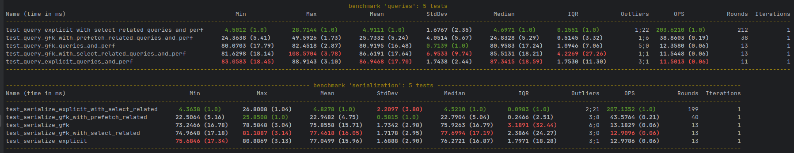

# 🧪 Django Relationship Benchmark

This project benchmarks the performance of two different data modeling strategies in Django:

- **GenericForeignKey** (GFK) from Django's contenttypes framework
- **Multiple explicit ForeignKey fields**

## 📌 Objective

To compare the efficiency and performance of accessing and serializing related objects using:

- Insert performance
- Query performance
- Serialization speed
- Access to related fields (e.g., `ProfileA.name`, `ProfileB.email`, etc.)

This is especially useful when deciding between `GenericForeignKey` and explicit foreign keys in Django applications.

Even though `GenericForeignKey` is more flexible, it can lead to performance issues and complexity in larger applications.


## 🛠️ Setup

1. **Install dependencies**:

```bash
pip install -r requirements.txt
```

2. **Run migrations**:

```bash
python manage.py migrate
```

3. **Run benchmarks**:

```bash
pytest tagging/tests/tests.py  --benchmark-enable
```

## 📊 Number of SQL Queries per Serialization Strategy (500 objects)

| **Strategy**                               | **Number of Queries** |
| ------------------------------------------ | --------------------- |
| GFK serialization                          | 501                   |
| GFK + `select_related("content_type")`     | 501                   |
| GFK + `prefetch_related("content_object")` | 105                   |
| Explicit FK serialization                  | 501                   |
| Explicit FK + `select_related(...)`        | ✅ **1**               |

## 📈 Benchmark Results




